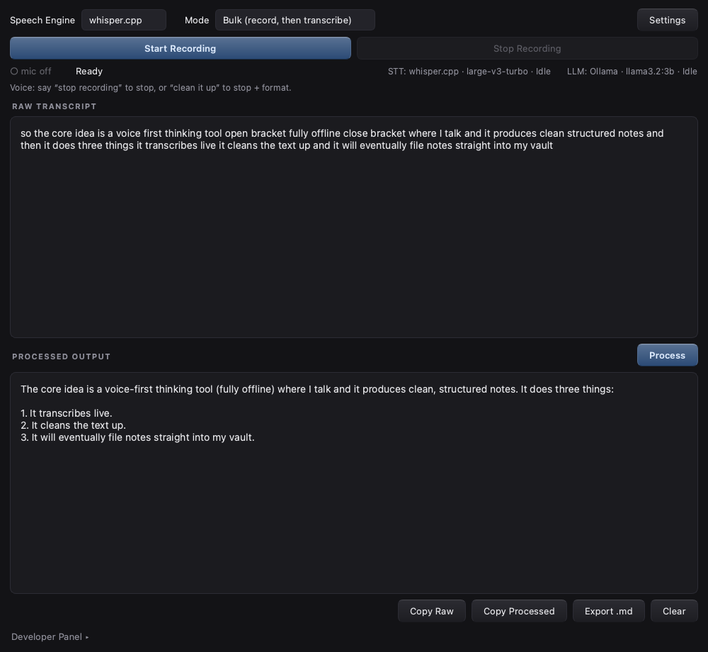
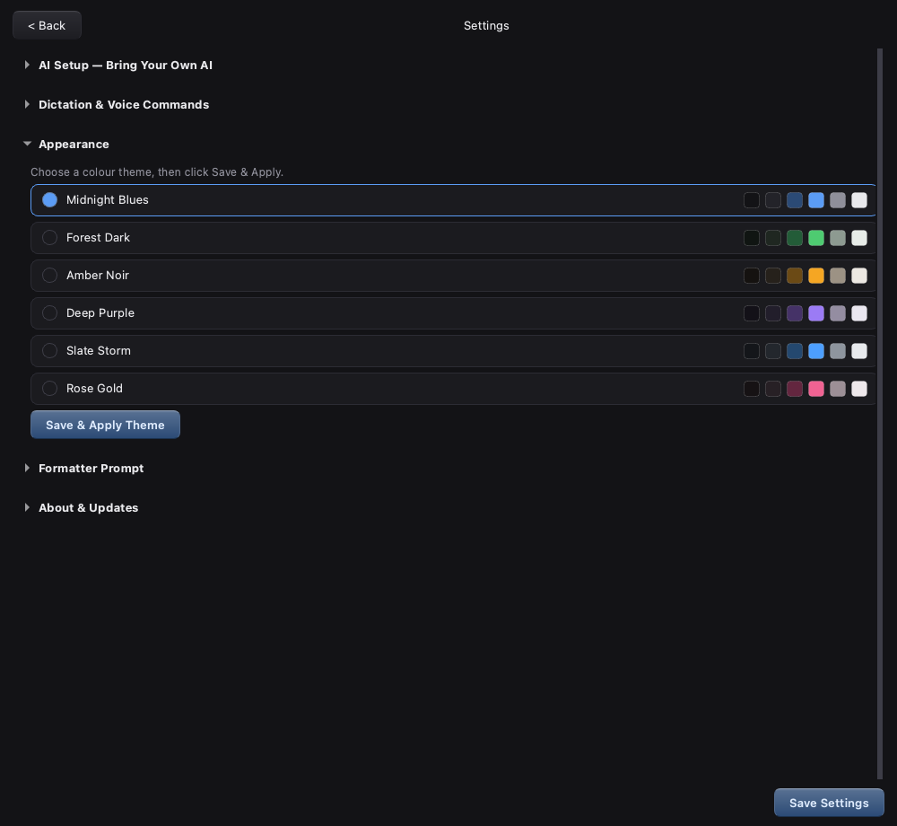

# Voise

[](https://github.com/gitwreckedav/Voise/releases/latest)
[](LICENSE)


**Offline, privacy-first voice → clean text for macOS.** Speak, watch the raw
transcript appear live, then say *"clean it up"* — a local language model
turns your stream of thought into polished, structured text. No audio, text,
or telemetry ever leaves your machine.



## How it works

```
Microphone → STT Socket (whisper.cpp) → Raw transcript (OT1)
                                             ↓  user-triggered
             Clean text (OT2) ← LLM Socket (Ollama)
```

Voise is **BYOAI — Bring Your Own AI**. The app ships with no bundled models;
it exposes *sockets* and guides you through connecting local engines that fit
your hardware. Every pipeline stage is inspectable in-app: active provider,
loaded model, current operation, latency. Nothing is a black box.

## Features

- **Live streaming transcription** — audio is cut at natural pauses in
  speech; text types itself out roughly a second behind your voice
- **Hands-free flow** — voice commands stop the recording or trigger
  formatting; both phrases are customizable
- **Spoken punctuation** — "open bracket … close bracket", "new paragraph"
- **Custom vocabulary** — teach the transcriber names and domain terms
- **Editable formatter prompt** — shape the output style; a protected
  default is always one click away
- **Six dark themes** — applied live, no restart
- **Markdown export** — Obsidian vault integration is next on the roadmap
- **Transparent pipeline** — status row plus a collapsible Developer Panel



## Setup

Voise requires two local engines. *Settings → AI Setup* shows live
connection status and walks through both:

1. **Speech-to-text** — `brew install whisper-cpp`, download a ggml model
   (e.g. `ggml-large-v3-turbo.bin`), set its path in AI Setup.
2. **Formatter** — install [Ollama](https://ollama.com), then
   `ollama pull llama3.2:3b`. Any locally pulled model can be used.

## Install

Download the latest DMG from
[Releases](https://github.com/gitwreckedav/Voise/releases/latest), drag
Voise.app to Applications. The app is unsigned: on first launch,
right-click → Open, and grant microphone access when prompted.

Updates: Voise can check the Releases feed on launch (version metadata
only; disable anytime in *Settings → About & Updates*) and links you to the
new DMG when one exists.

## Run from source

```bash
git clone https://github.com/gitwreckedav/Voise.git && cd Voise
python -m venv .venv
.venv/bin/pip install -r requirements.txt
.venv/bin/python app.py
```

Package a native build with `scripts/build_app.sh` →
`dist/Voise.app` + versioned DMG.

## Architecture principles

- Offline by default; the update check is the sole, optional network call
- The GUI communicates only with sockets (Recorder / STT / LLM), never with
  providers directly — engines are swappable without touching the interface
- Long term, the socket architecture is the seed of a broader local AI
  stack: more sockets, richer model roles, same privacy constraints
  (see [docs/Voise_MicroPRD.md](docs/Voise_MicroPRD.md))

## License

[MIT](LICENSE)
